<h3 align="center">Full Stack Developer 👋</h3>

Técnico Superior en Desarrollo de Aplicaciones Web y Multiplataforma, con base en Madrid, España. 
Desarrollador Full Stack con amplios conocimientos tanto en el entorno Front-End como Back-End,
además de experiencia trabajando con Microsoft Dynamics 365 Business Central, Power BI y Power Apps.

 

## 💻 Sobre mí

- 🎓 **Técnico Superior** en Desarrollo de Aplicaciones Web y Multiplataforma (DAW)
- 🚀 **Desarrollador Full Stack**, con conocimientos sólidos en Front-End y Back-End
- 🎨 **Front-End:** HTML5, CSS3, JavaScript
- ⚙️ **Back-End:** Java, PHP, Python
- 🗄️ **Bases de datos:** SQL, SQLite, SQL Server
- 📊 **Microsoft Business Apps:** Dynamics 365 Business Central, Power BI, Power Apps
- 📍 **Ubicación:** Madrid, España

 

## 🛠️ Languages and Tools

  
  
  
  
  
  
  
  
  
  
  
  
  
  
  
  
  
  
  

  
  

 

## 📊 GitHub Stats

  
  

  

 

## 👻 Actividad reciente

<picture>
  <source media="(prefers-color-scheme: dark)" srcset="https://raw.githubusercontent.com/Prometheus118/Prometheus118/output/pacman-contribution-graph-dark.svg">
  <source media="(prefers-color-scheme: light)" srcset="https://raw.githubusercontent.com/Prometheus118/Prometheus118/output/pacman-contribution-graph.svg">
  
</picture>

 

## 📬 Contacto / Contact

  
  

  

✨ ¡Gracias por visitar mi perfil! / Thanks for visiting my profile! ✨

